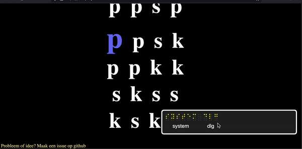

# paks
Accessible music rhythm website

## Rhythms

The rhythms are described with dutch fruit names.

- peer (🍐): clap - - -
- appel (🍎):  clap - clap -
- kokosnoot (🥥): clap clap clap -
- sinasappel (🍊): clap clap clap clap

That is why the website is called paks. Peer Appel Kokosnoot Sinasappel

## Usage

paks is a [website](https://paks.pruijs.net)

### With screenreaders

Make sure you turn on your screen reader.
On mac, you can turn on VoiceOver with (**cmd F5**)

1. go to the [website](https://paks.pruijs.net)
2. Connect a refreshable braille display.
3. Navigate to the textfield. It is the first item on the page.
4. Mute sound. This works best with braille.

You can see each fruit described with a character.
The fruit that is highlighted for visual people is also highlighted with the bottom braille dots. (7 and 8)

If you do not see any character highlighted, move the arrow keys until it does.

**fun fact**: You can easily connect multiple braille diplays with a mac. Turn on VoiceOver, plug them in and it should work :D
